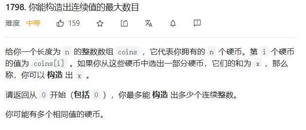

代码：

```c++
class Solution {
public:
    int getMaximumConsecutive(vector<int>& coins) {
        sort(coins.begin(),coins.end());
        
        int curNum = 0;
        for(auto n : coins)
        {
            if(n <= curNum+1) curNum += n;
            else break;
        }

        return curNum + 1;
    }
};
```

